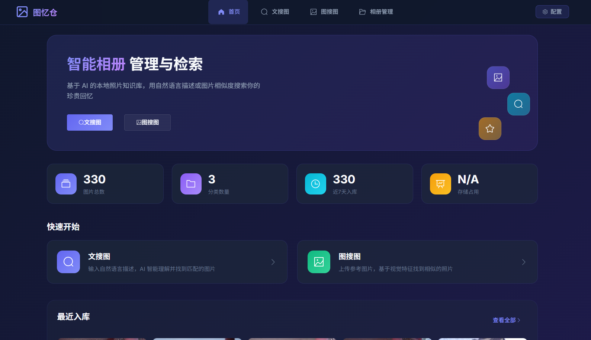
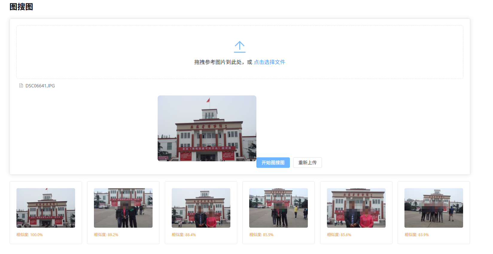
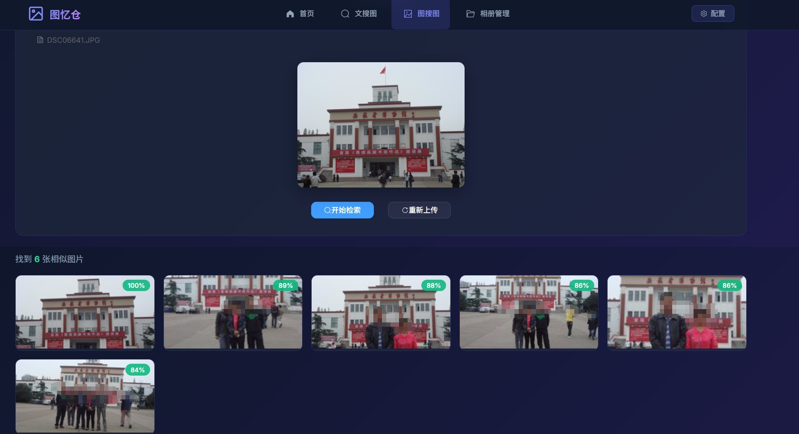
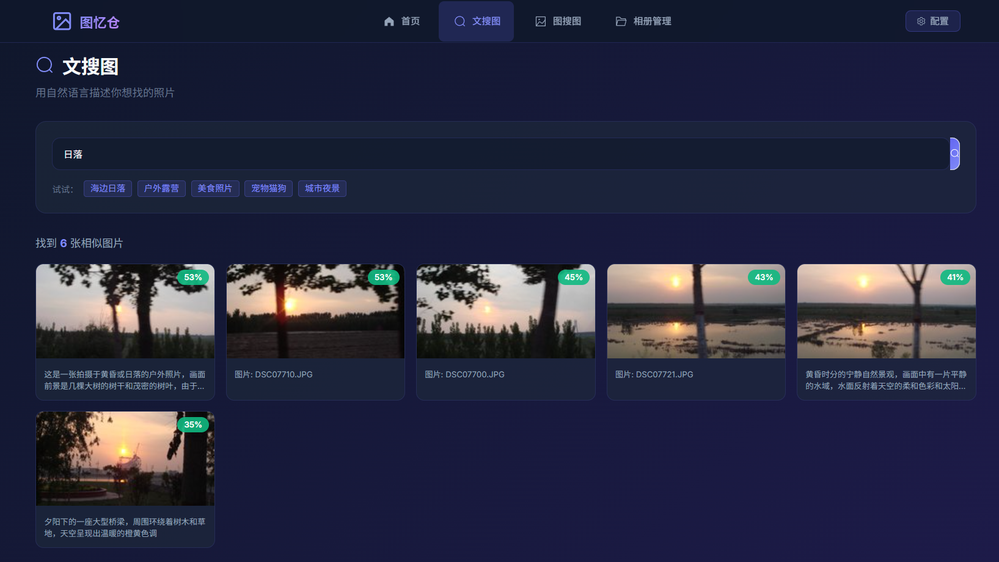

# TuYiCang
[简体中文](README.md) | [English](README_EN.md)

A private local photo album knowledge base built on multimodal AI and unified multimodal embedding space technology, supporting dual core functions: **text-to-image search** and **image-to-image search**.

<div align="center">
  
  
  
</div>

## Project Introduction
TuYiCang is a lightweight local photo retrieval system that realizes intelligent image management via multimodal AI. Fully private deployment ensures that all models, data and images are stored locally without external network requests, fully protecting user privacy.

### Core Features
- **Dual-mode Retrieval**: Supports text-to-image search and image-to-image search
- **Intelligent Import**: Automatic scanning, preprocessing, deduplication and EXIF metadata extraction
- **Incremental Update**: Real-time monitoring of local photo directories, automatically synchronizing newly added, modified and deleted images
- **Tag Management**: AI-generated image tags with manual editing and filtering functions
- **Fully Private Deployment**: All data stored locally, offline available, privacy-oriented
- **Lightweight Design**: Quantized models with low VRAM usage, suitable for personal computer deployment

## Tech Stack
### Backend
- **Programming Language**: Python 3.9.10
- **Vision Language Model (VLM)**: qwen3.5-0.8b (deployed via Ollama)
- **Text Embedding Model**: ~~qwen3-embedding:0.6b (Ollama)~~ (Deprecated. Shared **Qwen3-VL-Embedding-2B** for both text and vision embedding)
- **Vision Embedding Model**: Qwen3-VL-Embedding-2B (deployed via vLLM)
- **Vector Database**: Milvus v2.4.8
- **Metadata Database**: SQLite 3.41.2

### Frontend
- **Framework**: Vue 3 + Element Plus
- **Runtime**: Node.js 16.18.0
- **Architecture**: Frontend-backend separation

### Auxiliary Libraries
- Pillow 9.5.0 (Image processing)
- exifread 2.3.2 (EXIF parsing)
- watchdog 2.3.1 (Directory monitoring)
- PyYAML 6.0 (Configuration parsing)
- requests 2.31.0 (API requests)

## System Architecture
The system adopts an 8-layer decoupled architecture:
1. **Storage Layer**: Local disk storage (original images, preprocessed images, thumbnails, vector database, metadata database)
2. **Database Layer**: SQLite for metadata tables and system configuration
3. **Preprocessing Layer**: File scanning, format adaptation, EXIF parsing, MD5 deduplication, image resizing
4. **Model Inference Layer**: VLM inference, text embedding, vision embedding service calls
5. **Vector Index Layer**: Milvus vector database with semantic text indexing and visual similarity indexing
6. **Business Logic Layer**: Retrieval engine, incremental monitoring, deduplication logic, result post-processing
7. **Configuration Management Layer**: Config loading, validation, update, backup and reset
8. **User Interaction Layer**: Frontend pages (homepage, text search, image search, album management, settings)

## Quick Start
### System Requirements
- Python 3.9.10 or higher
- Node.js 16.18.0 or higher
- GPU: 16GB VRAM is sufficient without long-context inference
- Minimum 8GB RAM
- At least 10GB free disk space

### Installation Steps
#### 1. Clone the repository
```bash
git clone https://github.com/l1005268416/TuYiCang.git
cd TuYiCang
```

#### 2. Install backend dependencies
```bash
pip install -r requirements.txt
```

#### 3. Install frontend dependencies
```bash
cd frontend
npm install
```

#### 4. Deploy Milvus
```bash
mkdir -p milvus && cd milvus

wget https://github.com/milvus-io/milvus/releases/download/v2.4.8/milvus-standalone-docker-compose.yml -O docker-compose.yml

sudo docker compose up -d
```

For user authentication setup:
https://www.ai-community.tech/docs/adminGuide/authenticate.md

#### 4. Deploy Model Services
**Deploy Ollama (VLM)**
```bash
# Install Ollama
curl -fsSL https://ollama.com/install.sh | sh

# Pull model
ollama pull qwen3.5-0.8b

# Start Ollama service (auto-start by default)
ollama serve
```

Ollama has slow token generation. **vLLM deployment is recommended**:
```bash
vllm serve Qwen3.5-0.8B/ --port 8000 --max-model-len 6048 --reasoning-parser qwen3 --enable-auto-tool-choice --tool-call-parser qwen3_coder --trust-remote-code --served-model-name Qwen3.5-0.8B --max-num-seqs 2  --gpu-memory-utilization=0.5 --default-chat-template-kwargs '{"enable_thinking": false}'  --enable-prefix-caching --max-num-batched-tokens 2048
```

**Deploy vLLM for Vision Embedding Model**
```bash
# Install vLLM
pip install vllm

# Start vision embedding service
vllm serve Qwen3-VL-Embedding-2B \
--runner pooling \
--max-model-len 36000 \
--served-model-name Qwen3-VL-Embedding-2B \
--port 8022
```

#### 5. System Configuration
After first launch, configure via Web UI:
1. Visit http://localhost:8080
2. Open **Configuration** page
3. Set album path, model service endpoints and other parameters
4. Settings are automatically saved to database

#### 6. Start Services
**Start backend**
```bash
python app.py
```

**Start frontend**
```bash
cd frontend
npm run dev
```

#### 7. Access the System
Open your browser and visit:
http://localhost:3000

## User Guide
### Image Import
1. Set root album path in configuration
2. System automatically scans all images in directory
3. Preprocessing: deduplication, resizing, EXIF extraction
4. Models generate text descriptions, tags and feature vectors
5. All metadata, vectors and thumbnails are stored locally

### Text-to-Image Search
1. Navigate to Text Search page
2. Enter keywords (e.g. "sunset by sea", "cat")
3. Convert query text to semantic vector
4. Retrieve similar images from vector database
5. Display results sorted by similarity

### Image-to-Image Search
1. Navigate to Image Search page
2. Upload a reference image
3. Convert image to visual feature vector
4. Retrieve visually similar images from database
5. Display results sorted by similarity

### Incremental Update
The system monitors album folders via watchdog:
- New images: auto import
- Modified images: reprocess and re-embed
- Deleted images: removed from all databases

### Tag Management
1. View AI-generated tags on album management page
2. Manual tag editing supported
3. Filter images by tags
4. Bulk tag operations available

## Project Structure
```
TuYiCang/
├── backend/                 # Backend source code
│   ├── core/               # Core modules
│   │   ├── preprocessing/  # Image preprocessing
│   │   ├── inference/      # Model inference
│   │   ├── vector/         # Vector database operations
│   │   └── business/       # Business logic
│   ├── database/           # Database module
│   ├── config/             # Configuration management
│   ├── api/                # REST API endpoints
│   └── main.py             # Backend entry
├── frontend/               # Frontend source code
│   ├── src/
│   │   ├── components/     # Vue components
│   │   ├── views/          # Page views
│   │   ├── api/            # Frontend API requests
│   │   └── utils/          # Utility functions
│   └── package.json
├── config/                 # Configuration files
│   └── config.yaml
├── data/                   # Data directory
│   ├── database/           # SQLite database
│   ├── vector/             # Milvus vector storage
│   └── cache/              # Cache files
│       └── thumb/          # Image thumbnails
├── doc/                    # Documentation
│   └── TuYiCangSDDD.md    # System detailed design document
├── requirements.txt        # Python dependencies
└── README.md              # Project readme
```

## Configuration
All system settings are managed via Web UI and persisted in SQLite database.

### Main Configuration Items
- **Album Settings**
  - `photo_root_path`: Root directory of your photo library
  - `valid_extensions`: Supported formats (.jpg, .jpeg, .png, .webp, .bmp)
  - `min_file_size_kb`: Minimum file size (default: 50KB)
  - `max_file_size_mb`: Maximum file size (default: 50MB)

- **Model Service Endpoints**
  - `ollama_api_url`: Ollama API address (default: http://localhost:11434)
  - `vllm_api_url`: vLLM API address (default: http://localhost:8022)

- **Preprocessing Settings**
  - `target_max_edge`: Maximum resized image edge (default: 1024px)
  - `enable_vision_dedup`: Enable visual deduplication (default: true)

- **Retrieval Settings**
  - `text_top_k`: Number of results for text search (default: 20)
  - `vision_top_k`: Number of results for image search (default: 20)
  - `vision_similarity_threshold`: Visual similarity threshold (default: 0.65)

- **System Paths**
  - `cache_dir`: Cache directory (default: ./data/cache)
  - `database_path`: SQLite database path (default: ./data/database/tuycang.db)
  - `vector_store_path`: Vector database path (default: ./data/vector)

## Performance Metrics
- **Maximum Image Capacity**: 10,000+ images
- **Text Search Latency**: < 0.2s
- **Image Search Latency**: < 0.2s
- **Import Speed**: 100–300 images per minute (hardware-dependent)
- **VRAM Usage**: Approximately 6–12GB
- **Inference Speed (NVIDIA V100)**:
  VLM inference: ~0.55s per request
  Text embedding: ~0.26s per request
  Vision embedding: ~0.20s per request
  Concurrent processing supported

```plain
[2026-04-20 18:20:43] [INFO] [app.services.inference] VLM inference completed in 0.55s (attempt 1)
[2026-04-20 18:20:44] [INFO] [httpx] HTTP Request: POST http://192.168.1.149:11434/v1/embeddings "HTTP/1.1 200 OK"
[2026-04-20 18:20:44] [INFO] [app.services.inference] Text embedding inference completed in 0.26s (attempt 1)
[2026-04-20 18:20:44] [INFO] [httpx] HTTP Request: POST http://192.168.1.149:8022/v1/embeddings "HTTP/1.1 200 OK"
[2026-04-20 18:20:44] [INFO] [app.services.inference] Vision embedding inference completed in 0.20s (attempt 1)
```

## FAQ
### Q: Why is model inference slow?
A: Try these optimizations:
1. Use full GPU acceleration
2. Adjust batch size parameters
3. Switch to smaller model variants

### Q: How to back up my data?
A: Regularly back up these directories:
- `data/database/` (metadata database)
- `data/vector/` (vector storage)
- `data/cache/` (thumbnail cache)

### Q: What image formats are supported?
A: .jpg, .jpeg, .png, .webp, .bmp. Other formats will be automatically converted to JPEG.

### Q: How to reset the system?
A:
1. Delete all files under `C:\Users\Username\AppData\Local\tuyicang` for full reinitialization.
2. Clear all data in Milvus.

### Q: Can I use other models?
A: Yes. The system is compatible with any model following OpenAI-compatible API specifications for easy extension.

### Q: Why is VRAM usage so high?
A: Qwen3-VL-Embedding-2B consumes most VRAM (~13GB). Due to hardware limitations of the V100 GPU, quantized versions such as Qwen3-VL-Embedding-2B-GPTQ-Int4 cause array overflow during image embedding. If your GPU supports this quantized model, VRAM usage will be significantly reduced.

### Q: Is Milvus mandatory?
A: No. Without Milvus, vectors are stored in memory and will be lost after restart. Milvus can be deployed via Docker for persistent vector storage.

### Q: Why use Qwen3-VL-Embedding-2B for text embedding as well?
A: Qwen3-VL-Embedding-2B provides a **unified text-image semantic space**. Text search with this unified model outperforms the pipeline of VLM captioning + separate text embedding model. Text descriptions generated by VLM are inherently lossy compression, and many fine-grained visual details cannot be fully expressed in words.



## Development Roadmap
- [√] System architecture setup
- [√] VLM inference module
- [√] Text embedding module
- [√] Image embedding module
- [√] Async inference & retry mechanism
- [√] Multithreaded concurrent processing
- [√] Metadata management
- [√] Initial image import
- [√] Incremental update mechanism
- [√] Text-to-image search
- [√] Image-to-image search
- [√] System configuration management
- [√] API interface development
- [√] Album management UI
- [√] Image category management
- [ ] Bulk import & export functions

## License
MIT License

## Links
- Project Repository: https://github.com/l1005268416/TuYiCang
- Issues & Feedback: https://github.com/l1005268416/TuYiCang/issues

## Acknowledgements
This project relies on the following open-source projects:
- Ollama
- vLLM
- Milvus
- Vue.js
- Element Plus